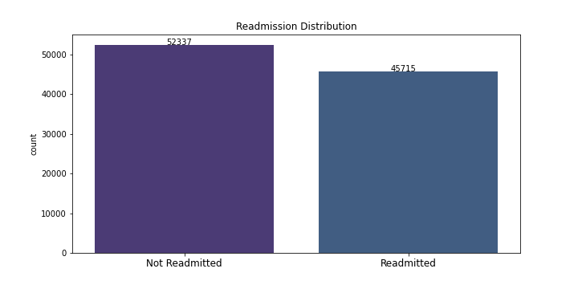
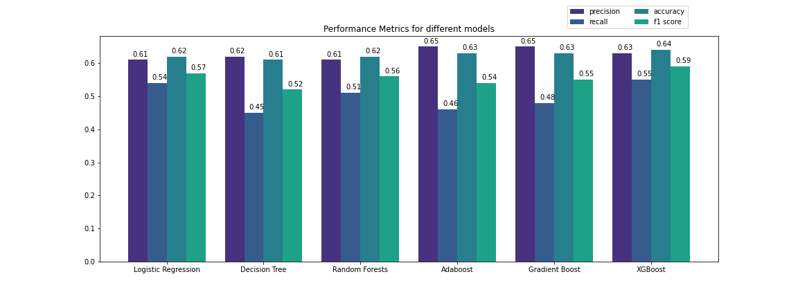
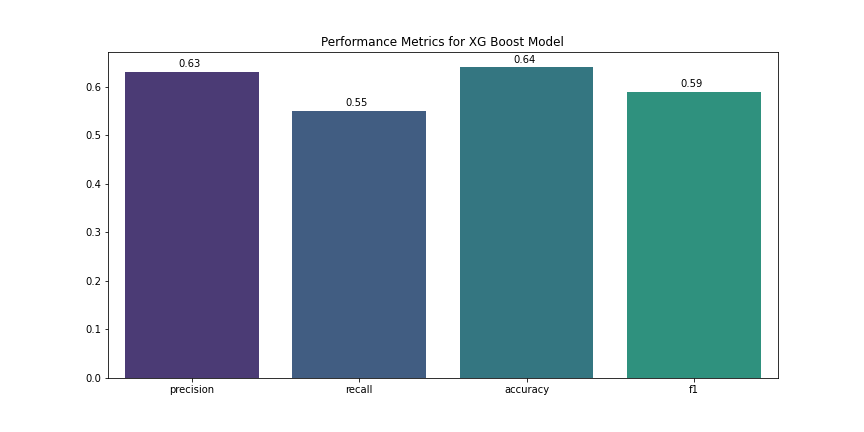
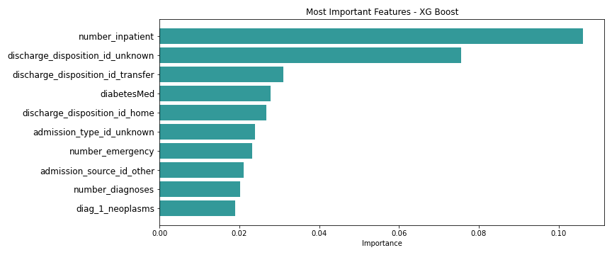

# Prediction on Hospital Readmissions for Diabetes Patients


<a href="https://www.freepik.com/vectors/background">Background vector created by katemangostar - www.freepik.com</a>

**Author:** Samantha Knee

## Overview

In this project, we have been tasked with helping a hospital build a model that predicts whether or not a diabetes patient will be readmitted to the hospital. We were able to obtain the best predictions using an XGBoost algorithm, which showed number of inpatient visits, discharge type and whether or not a patient is on diabetes medication were the most important factors in determining whether or not there would be a readmission. Our model will help the hospital determine which patients are most at risk for readmission and allow them to focus resources on those patients to reduce costly readmissions.

***

## Business Problem

Readmissions are a major problem facing hospitals across the US. Not only do they cost hospitals millions of dollars annually, but they also lead to poor patient outcomes and potential infections that could have been prevented. According to a 2007 MedPac report, 17.6% of Medicare patients were readmitted to the hospital within 30 days of discharge, which represents $15 billion in spending. We have been hired by a hospital to build a classification model that helps them determine which patients are most likely to be readmitted, and which features of a patient are most important in predicting a readmission.

***

## Data

The dataset used consists of 10 years (1999-2008) of hospital records on diabetes patients from 130 hospitals in the U.S. There are 50 features including the patient’s age, race and gender, which medication the patient is on and if it changed during the visit, the number of emergency or inpatient visits in the previous year, and whether or not the patient was readmitted to the hospital, among many others.



***

## Methods

To find the best performing classification model, we iterated through a number of different models/algorithms, including logistic regression, decision trees, random forests and boosting methods. Using recall as our primary evaluation metric while also evaluation precision, accuracy and F1 score, we found the model that used an XGBoost algorithm had the strongest performance. Before running these models, we cleaned the data and made sure all missing values were handled and categorical variables were regrouped and converted to dummy variables.



***

## Results

The final model we chose had a precision score of 0.63, a recall score of 0.55, an accuracy score of 0.64 and a f1 score 0.59.



Some of the top most important features of our model are:
* Inpatient visits
* Discharge disposition type
* Diabetes medication
* Number of diagnoses




***

## Conclusions

* **The hospital should take extra care before discharging patients to home.** For patients that are discharged, the ones most likely to be readmitted are patients discharged to home. Setting a higher standard of discharge for patients being released to home should help prevent some of these costly readmits.

* **The hospital should focus resources on patients on Diabetes medication.** These patients are more likely to be readmitted to the hospital. This may have something to do with patients on Diabetes medication being in poorer health, but we still believe it makes sense to focus on these high risk patients.

* **As the number of diagnoses increases, so does the likelihood a patient will be readmitted.** The hospital should focus resources on these individuals with more than 5 diagnoses. The only exception is patients with a primary diagnosis of neoplasms, as this diagnosis is less likely to be readmitted.

***

## Next Steps

* With more time and resources, we would use different strategies of cleaning the data and see if model performance improves. This could include scaling continuous variables or dealing with the categorical variables in a different way, whether converting some of them to be continuous or binning them in a different way.

* We could also try using different hyperparameters in our final model. We performed grid search on a number of parameters, but we could try grid search on different parameters or different values of those parameters to see if our results could improve.

* Lastly, it might be helpful to perform separate analyses on different types of patients.  There could be very different factors affecting readmission for a patient in the hospital with circulatory issues versus digestive issues. By analyzing these patients separately, we could gain better insight into what is driving the readmissions.

***

## For More Information

Please review the EDA in this [Jupyter Notebook](./Diabetes_Readmissions_EDA.ipynb), the full modeling analysis in this [Jupyter Notebook](./Diabetes_Readmissions_Models.ipynb), and this [presentation](./Hospital_Readmission_Analysis_Presentation.pdf).

For any additional questions, please contact **Samantha Knee at samanthaknee24@gmail.com**


<a href='https://www.freepik.com/vectors/background'>Background vector created by macrovector_official - www.freepik.com</a>


## Repository Structure


```
├── README.md                                          <- The top-level README for reviewers of this project
├── Diabetes_Readmissions_EDA.ipynb                    <- Narrative documentation of data cleaning in Jupyter notebook
├── Diabetes_Readmissions_Models.ipynb                 <- Narrative documentation of analysis in Jupyter notebook
├── Hospital_Readmission_Analysis_Presentation.pdf     <- PDF version of project presentation
├── data                                               <- Both sourced externally and generated from code
└── images                                             <- Both sourced externally and generated from code
```

